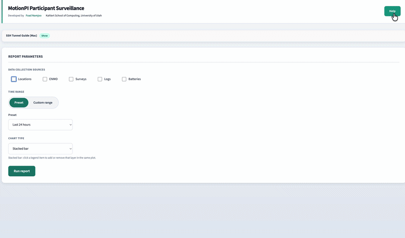

## Demo — Configure, run, and explore results

<p align="center">
  
</p>

# MotionPI Active Participants Report

MongoDB-backed report for active participants: table and charts by data source (location, ENMO, surveys, logs, batteries) with configurable time window and timezone.

## Features

- **CLI**: Run queries from the terminal (`python mongodb_query.py`).
- **Web report**: HTML app + Flask server — choose time window, run report, view table and chart, download CSV and PNG.
- **Standalone HTML**: Share the HTML file; users enter the report server URL and run reports without installing Python.
- **Log-event columns**: When Logs is selected, the report includes counts for wristband disconnects, data collection disabled, activity survey expired, and PA survey denied to support compliance monitoring.
- **Help page**: In-app Help (link in header) explains how to use the report, defines all terms, summarizes log events, and gives MongoDB query examples. A separate **Log Event Documentation** document (created for users) describes every event name and how to query them in MongoDB Compass.

## Setup

1. **Clone and enter the repo**
   ```bash
   git clone https://github.com/foadnamjoo/motionpi-behavior-monitoring.git
   cd motionpi-behavior-monitoring
   ```

2. **Create a virtual environment and install dependencies**
   ```bash
   python3 -m venv venv
   source venv/bin/activate   # Windows: venv\Scripts\activate
   pip install -r requirements.txt
   ```

3. **Configure MongoDB**
   - Copy `.env.example` to `.env`.
   - Set `MONGODB_URI` to your connection string (from MongoDB Compass or your provider). **Do not commit `.env`.**

## Usage

### Command-line report

```bash
source venv/bin/activate
python mongodb_query.py
```

Uses the default weekly report (last 7 days, America/Denver). Edit `QUERIES` in `mongodb_query.py` to change.

### Web report

1. **Start the server** (on a machine that can reach MongoDB):
   ```bash
   source venv/bin/activate
   python report_server.py
   ```
   By default the server binds to **127.0.0.1:5050** (local only). Open **http://127.0.0.1:5050/** in a browser.

2. **Optional deployment settings** (environment variables):
   - `REPORT_HOST` — e.g. `0.0.0.0` to listen on all interfaces (only if needed and network is trusted).
   - `REPORT_PORT` — default `5050`.
   - `REPORT_DEBUG` — set to `1` or `true` only for local development; never in production.
   - `CORS_ORIGIN` — if the HTML is opened from another origin (e.g. file or different domain), set to that origin or `*`. Leave unset for same-origin only (recommended when the page is served from this server).
   - `REPORT_API_KEY` — if set, the API requires the `X-API-Key` header (or `api_key` query param) to match. Use in production to protect the report endpoint.

3. **Standalone HTML**: Open `report_app.html` elsewhere, enter the report server URL, and run the report. The server must have `CORS_ORIGIN` set (e.g. `*` or the page origin) for cross-origin requests to work; prefer also setting `REPORT_API_KEY`.

## Security

- **Never commit** `.env`, credentials, tokens, or private URLs. Use `.env.example` only as a template.
- **Server defaults** are safe: `debug=False`, `host=127.0.0.1`. Override with env vars only when needed.
- **CORS**: Disabled by default. Set `CORS_ORIGIN` only when you need cross-origin access (e.g. standalone HTML); use a specific origin instead of `*` when possible.
- **API key**: Set `REPORT_API_KEY` in production and send it in the `X-API-Key` header (or `api_key` query) from the client if you expose the server beyond localhost.

## Packaged app (double-click, no Python visible)

You can build a single app that starts the server and opens the browser so users don’t need Python installed.

1. **Install build dependency**
   ```bash
   pip install -r requirements-build.txt
   ```

2. **Build**
   ```bash
   pyinstaller MotionPI_Report.spec
   ```

3. **Output**
   - **macOS**: `dist/MotionPI Report` (single executable). Double-click it; the server starts and the default browser opens to the report.
   - **Windows**: `dist/MotionPI Report.exe`. Same behavior.

4. **Zip for distribution (Mac)**  
   To build and pack the app with a config template so users can point to your MongoDB:
   ```bash
   ./build_and_zip.sh
   ```
   This produces **`MotionPI_Report_Mac.zip`** containing the app and `config.env`. Replace the placeholder `MONGODB_URI` in `config.env` with your real connection string before sending the zip to users (or have users set it). Users unzip, then double-click **MotionPI Report** (keep `config.env` in the same folder). No Python on their machine; data comes from your MongoDB.

5. **Distribute — what to send to users**
   - **Build the zip** (from project root):
     ```bash
     ./build_and_zip.sh
     ```
     This creates **`MotionPI_Report_Mac.zip`** in the project root (for **Apple Silicon** M1/M2/M3 Macs).
   - **Intel Macs (e.g. 2019 MacBook Pro)** get “bad CPU type in executable” with that zip. Build an Intel version on your Apple Silicon Mac:
     ```bash
     ./build_intel.sh
     ```
     This creates **`MotionPI_Report_Mac_Intel.zip`**. Send that to Intel Mac users. (Requires Rosetta 2 and `arch -x86_64 python3`; see the script if the venv fails.)
   - **Before sending**: Open `dist/config.env` (or edit before zipping) and set **`MONGODB_URI`** to your MongoDB connection string so the report can read data. Do not commit this file with real credentials.
   - **Send to users**: **`MotionPI_Report_Mac.zip`** for Apple Silicon, **`MotionPI_Report_Mac_Intel.zip`** for Intel Macs (or the contents of `dist/`: **MotionPI Report**, **config.env**, **README.txt**).
   - **User steps**: (1) Unzip the folder. (2) Keep **config.env** in the same folder as **MotionPI Report**. (3) Double-click **MotionPI Report**; the browser opens to the report. (4) Use the report (time range, data sources, Run report, download from the green message bar). (5) Click **Help** in the header for the help page. No Python or terminal needed; to stop, quit the app.
   - **Without zip**: Give users the **MotionPI Report** executable and **config.env** (with `MONGODB_URI=...`) in the same folder. They double-click; to stop the server they quit the app (Activity Monitor / Task Manager).

## Verification before sending the zip

- [ ] Run `./build_and_zip.sh` (clean build includes `report_app.html` and `help.html`).
- [ ] Set `MONGODB_URI` in `dist/config.env` (or in `env.dist` before building). Do not commit real credentials.
- [ ] Unzip `MotionPI_Report_Mac.zip` in a test folder, keep **config.env** next to **MotionPI Report**, double-click the app.
- [ ] In the browser: run a report, open **Help** (top-right), use **Back to Report**, download CSV/chart from the green message bar. Then quit the app.

## Project structure

| File / folder           | Purpose |
|-------------------------|--------|
| `mongodb_query.py`      | Query definitions, time filters, report logic, CLI and plot generation |
| `report_server.py`      | Flask API for the web report |
| `report_app.html`       | Single-page report UI (table, chart, CSV/PNG download) |
| `launch_report_app.py`  | Launcher: starts server and opens browser (entry point for packaged app) |
| `MotionPI_Report.spec`  | PyInstaller spec for the packaged app |
| `env.dist`             | Config template copied as `config.env` in the zip (set `MONGODB_URI` before sending) |
| `build_and_zip.sh`     | Builds app (Apple Silicon) and zips it with `config.env` and `README.txt` |
| `build_intel.sh`       | Builds app for Intel (x86_64) Macs; produces `MotionPI_Report_Mac_Intel.zip` |
| `.env`                  | MongoDB URI for local run (create from `.env.example`; do not commit) |
| `requirements.txt`     | Python dependencies |
| `requirements-build.txt` | Same + PyInstaller (for building the app) |

## Time windows and collections

- **Time window**: Last 24 hours or last 7 days (MST/SLC by default).
- **Collections**: `userlocations`, `userenmos`, `surveys`, `userlogs`, `userbatteries` (per-collection timestamp units: ms vs seconds as in `COLLECTION_TIMESTAMP_UNITS`).

## License

Use as needed for the MotionPI project.
